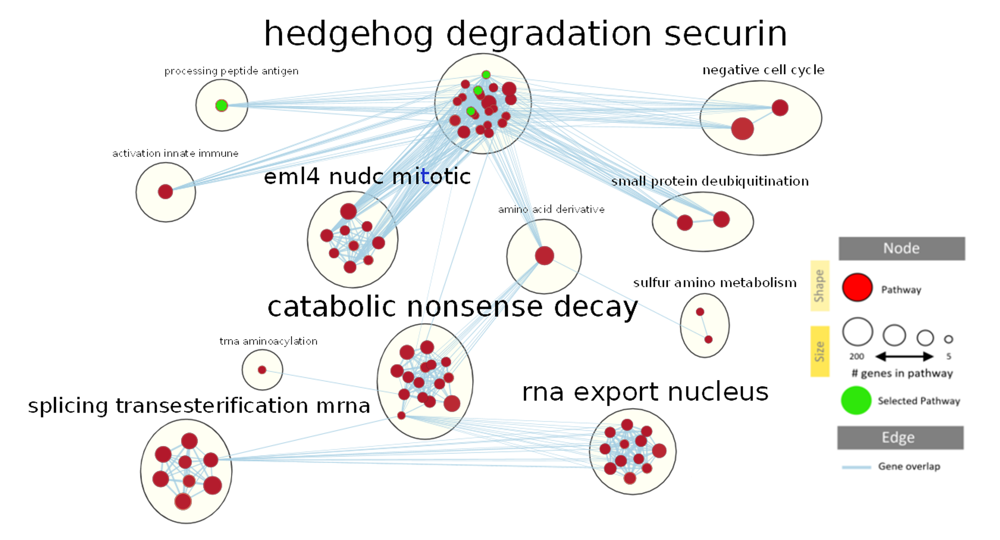
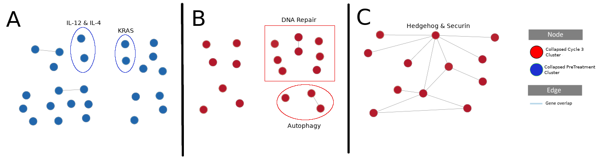

**Peripheral Blood CD8+ T cell in Pre-Anti-PD-1 Antibody vs Post-Anti-PD-1 Antibody Treated Melanoma Patients**

By Dong Hoon Han
BCB420 2020
<br>
*References are at the bottom of the html!


<style>
img {
    max-width: 2000px;
}
</style>

```{r set-options, echo=FALSE, cache=FALSE}
options(width = 1400)
```

```{r, message = FALSE, echo = TRUE, warning = FALSE, results = 'hide'}
# Install packages that are not there
packages = c("BiocManager", "tidyverse", "knitr", "rlang", 
             "devtools", "reshape2", "kableExtra","circlize", "RCurl",
             "png", "grid", "htmltools", "ggplot2", "cowplot",
             "magick", "readxl", "GSA", "VennDiagram")

bioconductor_packages = c("edgeR", "GEOquery", "biomaRt", "gprofiler2", "ComplexHeatmap", "HGNChelper")


install.packages(setdiff(packages, rownames(installed.packages())))

BiocManager::install(setdiff(bioconductor_packages, rownames(installed.packages())), update = FALSE)

if(!("annotables" %in% rownames(installed.packages()))){
  devtools::install_github("stephenturner/annotables")
}

# Load in all the packages
library(edgeR)          # Bioconductor
library(GEOquery)       # Bioconductor
library(tidyverse)
library(knitr)
library(biomaRt)        # Bioconductor
library(annotables)     # this is from devtools
library(gprofiler2)     # Bioconductor
library(reshape2)
library(kableExtra)
library(ComplexHeatmap) # Bioconductor
library(circlize)
library(HGNChelper)
library(RCurl)
library(png)
library(grid)
library(htmltools)
library(ggplot2)
library(cowplot)
library(magick)
library(readxl)
library(GSA)
library(VennDiagram)

# Loading in the Data
GSE96578 <- getGEO("GSE96578",GSEMatrix=FALSE)

Overall.Design <- data.frame(Overall.Design = GSE96578@header$overall_design)
Experiment.Summary <- data.frame(Experiment.Summary = GSE96578@header$summary)
```
## Preface to Pathway & Network Analysis {.tabset}

### Intro {.tabset}

Raw Counts Matrix of **GSE96578** was used in this analysis.
<br><br>

**Brief Intro to What's Been Done Up to Pathway & Network Analysis**

This analysis aims to figure out the transcriptomic differences in the peripheral CD8 T cells between different treatment cycles and pre-treatment of the pembrolizumab, anti-PD1 mAb in melanoma patients. There were 4 treatment cycles and 3 patients' blood sample has been taken in every treatment cycle.
<br><br>
After the raw counts matrix has been loaded in, it was subjected to filtering based on whether the feature has least 1 read per million in n of the samples, where n is the size of the smallest group of replicates. There were 3 biological replicates for this experiment (**Experimental Conditions** tab). 
<br><br>
After filtering and converting the raw counts to counts per million, trimmed mean of m values, and log normalization, were applied (**Normalization & ID Mapping** tab). Identity mapping was subsequently done. Those ensembl gene ids not mapped HGNC symbols were all kept. External gene symbol column was added from HGNChelper package.
<br><br>
Differential gene expression analysis was performed using Limma-Trend and Negative Binomial Generalized Linear Models with Quasi-likelihood test from limma v3.40.6 and edgeR package v3.26.8. (**Differential Gene & gProfiler** tab) 
<br><br>
Surprisingly, no individual genes met the threshold for statistical significance after multiple hypothesis testing correction between different treatment cycles. 
<br><br>
However, around 160 genes were statistially significant between patient B and patient C.
<br><br>
Then, the differential gene lists were obtained without multiple hypothesis correction between treatment cycle 3 & pre-treatment, treatment cycle 4 & cycle 3, and patient B & patient C.
<br><br>
Thresholded overrepresentation analysis using gprofiler was done on the 3 genelists. No unifying biological themes were found in the cycle 4 vs cycle 3 or cycle 3 vs pre-treatment genelist.
<br><br>
Instead, the CD8 T cell related immune genesets popped up between patients B and C. More specifically, those genesets were enriched in patient C than patient B (**Differential Gene & gProfiler** tab). In conjunction with the heatmap result that cluster the genes associated patient B and C together (**Differential Gene & gProfiler** tab), this suggests the striking difference of patient C's response to the drug compared to patient A & B's responses.
<br><br>
**You may now skip directly to Gene Set Enrichment Analysis (GSEA) section, or view more details about my pre-analysis on the tabs in the Preface section.**

```{r}
# Roughly what kind of experiment was this.
kable(Overall.Design)

```

```{r message = FALSE, echo = TRUE, warning = FALSE, results = 'hide'}
# Loading in the Raw Counts Matrix
# Two count matrixes: normalized & raw counts, using the raw counts matrix
sfiles <- getGEOSuppFiles("GSE96578")
fnames = rownames(sfiles)
# [1] "/home/rstudio/GSE96578/GSE96578_AH_PBMC_RNAseq_normcounts.txt.gz"
# [2] "/home/rstudio/GSE96578/GSE96578_AH_PBMC_RNAseq_rawcounts.txt.gz" 

# Loading in the raw count matrix
cd8_exp <-read.delim(fnames[2],header=TRUE, check.names = FALSE)
# Discarding that cycle2 sample
cd8_exp <- dplyr::select(.data = cd8_exp, -R_S418)
# Removing objects for sanity sake
rm( list = Filter( exists, c("sfiles", "fnames") ) )

```

**Summary Data Frame of the Samples Analyzed**
```{r}
##################################################################################
# What do each of these R_S4xx mean? i.e. what do each of these samples represent? ----
##################################################################################

sample.info.matrix <- data.frame()

# i under GSE96578@gsms is a GSE object, which can be probed using Meta() function
# Use for loop to probe each of the 13 samples
for(i in GSE96578@gsms){
  sample.info.matrix <- rbind(sample.info.matrix,
                       data.frame(Meta(i)$title, Meta(i)$characteristics_ch1[3],Meta(i)$characteristics_ch1[1],
                                  Meta(i)$characteristics_ch1[5], Meta(i)$library_strategy, Meta(i)$instrument_model))
}
colnames(sample.info.matrix) <- c("Title","Treatment", "Patient Age", "Disease State",
                                  "Data Type", "Instrument")
# sample.info.matrix

# Decided not to include R_S418 Cycle2 treatment in the downstream analysis, because
# there is no replicate for this Cycle2 treatment RNA-seq experiment
sample.info.matrix <- sample.info.matrix[-3,]

# head(sample.info.matrix)
# head(cd8_exp)


# Let's create a more descriptive label for each of the samples

descriptive.label <- c("pt.A.PreTreat", "pt.A.Cycle1", "pt.A.Cycle3", "pt.A.Cycle4",
                       "pt.B.PreTreat", "pt.B.Cycle1", "pt.B.Cycle3", "pt.B.Cycle4",
                       "pt.C.PreTreat", "pt.C.Cycle1", "pt.C.Cycle3", "pt.C.Cycle4")

sample.info.matrix %>% mutate(Label = descriptive.label) -> sample.info.matrix

sample.info.matrix %>% 
  mutate(Patient = stringr::str_match(string = sample.info.matrix$Label,
                                      pattern = "(?<=\\.)(.*)(?=\\.)")[,1]) %>%
  mutate(Treatment = stringr::str_match(string = sample.info.matrix$Label,
                                        pattern = "(?<=pt\\.[A-z]\\.)(.*)")[,1]) -> sample.info.matrix


# Lets change the Count Matrix Sample names to the more descriptive names as well

colnames(cd8_exp)[4:15] <- sample.info.matrix$Label

# Removing descriptive.label for sanity sake

rm( list = Filter( exists, c("descriptive.label", "i") ) )

kable(sample.info.matrix) %>% 
  kable_styling(bootstrap_options = "striped", full_width = F)
```

---


### Experimental conditions {.tabset}

**Patients with stage IV melanoma** were enrolled for treatment with **pembrolizumab (pembro), anti-PD-1 antibody (2 mg kg^-1 by infusion every 3 weeks)**. After receiving their consents, peripheral blood was obtained before treatment and before each pembro infusion every weeks for 12 weeks. [@huang2017t]

For RNA sequencing experiments, total CD8 T cells were sorted using a dump/dead-CD3^+^ CD8^+^ gating strategy, by BD Aria Sorter [@huang2017t]. Dump here means the exclusion channel which is used for staining everything you do not want.

So the **controls** are the RNA sequencing of total CD8 T cells before pembro infusion. 

The **tests** are the RNA sequencing of total CD8 T cells 3 weeks after each pembro infusion. 

Overall the samples are divided into cycle 1, 2, 3, 4, as pembro was injected at Week 0, 3, 6, 9, and the blood was drawn before pembro injection at Week 0, 3, 6, 9, 12. 

**Pretreatment samples** are week 0 pre-treatment peripheral blood CD8 T cells. These are the controls.

**Cycle 1 samples** are week 3 peripheral blood CD8 T cells after the week 0 pembro injection.

**Cycle 2 samples** are week 6 peripheral blood CD8 T cells after the week 0, 3 pembro injection.

**Cycle 3 samples** are week 9 peripheral blood CD8 T cells after the week 0, 3, 6 pembro injection.

**Cycle 4 samples** are week 12 peripheral blood CD8 T cells after the week 0, 3, 6, 9 pembro injection.

**Cycle 2 samples were not included** in this analysis, because other samples all had 3 replicates (from 3 patients) whereas there was only one cycle 2 sample (from a single patient).


**Comprehensive Sample Information Matrix** -> Not including R_S418 Cycle2 treatment in the downstream analysis, because there is no biological replicate for this Cycle2 treatment RNA-seq experiment
```{r}
kable(sample.info.matrix) %>% 
  kable_styling(bootstrap_options = "striped", full_width = F)
```


<!-- Experimental Summary -->

```{r, message = FALSE, warning = FALSE}
current_gpl <- names(GPLList(GSE96578))[1]   # GPL23177
current_gpl_info <- Meta(getGEO(current_gpl))
```
```{r}
GPL.frame <- data.frame(GPL.Title = current_gpl_info$title, Submission = current_gpl_info$submission_date, 
           Last.Update = current_gpl_info$last_update_date,
           Organism = current_gpl_info$organism, Number.of.Series = length(current_gpl_info$series_id), 
           Number.of.Samples = length(current_gpl_info$sample_id) )


kable(Experiment.Summary)
kable(GPL.frame) %>% 
  kable_styling(bootstrap_options = "striped", full_width = F)

rm(Overall.Design, Experiment.Summary, GPL.frame)
```


---

**Data Processing Protocol for all Samples from Fastq to Raw Counts**
```{r}
j = 0
Data_Processing <- list()
Extraction_Protocol <- list()
for(i in GSE96578@gsms){
  j = j + 1
  Data_Processing[[j]] <- Meta(i)$data_processing
  Extraction_Protocol[[j]] <- Meta(i)$extract_protocol_ch1
}
unlist(unique(Data_Processing))

# [[1]]
# [1] "The fastqs were aligned using STAR 2.5.2a and hg19"                                                             
# [2] "The aligned files were processed using PORT gene-based normalization 
# ( https://github.com/itmat/Normalization )"
# [3] "The differential gene expression was done with limma"                                                           
# [4] "Genome_build: hg19"                                                                                             
# [5] "Supplementary_files_format_and_content: Raw counts and normalized counts"     
```

---

**Extraction Protocol for all Samples**
```{r}
unlist(unique(Extraction_Protocol))

# [[1]]
# [1] "RNA was isolated using the Qiagen RNeasy micro kit (#74034) according to the manufacturer's 
# protocol"                                                                   
# [2] "RNA-seq libraries were prepared using the SMARTer Stranded Total RNA-Seq Kit for Pico Input Mammalian 
# from Clonetech according to the manufacturer's protocol (#635007)"
# [3] "The libraries were sequenced on an Illumina NextSeq machine using a 300 cycle high output 
# flow cell (#15057929)"   

# Removing j, i, Data_Processing, & Extraction_Protocol

rm(i, j, Data_Processing, Extraction_Protocol)
```


---

### Normalization & ID Mapping {.tabset}

<br>
**Dimension of the Raw Counts Matrix**
```{r}
dim(cd8_exp)
```

There are 28383 features (i.e. genes/nongenes) & 12 out of 15 columns are
samples; other 3 are ID, gene coordinate, gene symbol.
<br><br>
This raw count matrix consists of 4 triplet replicates so 12 samples in 
total: Pre-treatment, Cycle 1, Cycle 3, Cycle 4 
<br><br>
```{r}
# head(cd8_exp)

# Create a table of row counts for each factor (i.e. gene name or maybe sth else) in the geneSymbol column 
summarized_gene_counts <- sort(table(cd8_exp$geneSymbol),decreasing = TRUE)
```

**Filtering out weakly expressed and noninformative (non-aligned) features, all of which were done in edgeR**

```{r, warning = FALSE}
cpms <- cpm(cd8_exp[,4:15])

rownames(cpms) <- cd8_exp[,1]

# Filtering out low counts
keep <- rowSums(cpms >1) >=3 # So n is 3 here, and all features must have 1 read per million in 3 of the samples

cd8_exp_filtered <- cd8_exp[keep, ]

# dim(cd8_exp)            # [1] 28383    15
# dim(cd8_exp_filtered)   # [1] 17118    15
before_after <- t(data.frame(Before = dim(cd8_exp), After = dim(cd8_exp_filtered)))
colnames(before_after) <- c("Number of Features", "Number of Columns")

# Did this solve the duplicate issue?
summarized_gene_counts_filtered <- sort(table(cd8_exp_filtered$geneSymbol),decreasing = TRUE)

kable(before_after) %>% 
  kable_styling(bootstrap_options = "striped", full_width = F)
rm(before_after)
```

Genes with very low count across all libraries provide very little evidence for differential expression. Moreover,
the discreteness of these low counts interferes with some of the statistical approximations used in edgeR
package [@Robinson:2010:Bioinformatics:19910308]. 
<br> <br>
The genes were filtered with count-per-million (CPM) rather than raw counts, as raw counts do not account for
differences in library sizes between samples[@Robinson:2010:Bioinformatics:19910308].
<br>
<br>
$CPM_{i} = \frac{X_{i}}{N}\cdot 10^{6}$
<br>
<br>
Here $X_{i}$ is the count for certain gene and $\frac{N}{10^{6}}$ is the number of fragments you sequenced in the library per million. <br><br>
By processing the raw count to counts per million, the library size differences between samples can be accounted for.
<br><br>

```{r}
# Removing Data for Sanity Sake
rm( list = Filter( exists, c("keep", "summarized_gene_counts_filtered", "cpms", "summarized_gene_counts") ) )
```


**TMM Normalization**
<br>
Normalization is a necessary step to adjust the data so that we can focus more on biological variation than technical variation.
<br><br>
TMM between each pair of samples are used to calculate the scale factors for each library size that minimize log fold changes between the samples for most genes.
<br> <br>
The product of the library size and the scaling factor is called effective library size, which replaces the original library
size in all downstream analysis.[@robinson2010scaling]
```{r, Warning = FALSE}
##################################################################################
# Normalization - First step in Analysis ----
##################################################################################

# We want to look a biological variation rather than technical variation
# Our sampling of data will form certain distribution like normal, bimodal, poisson, power log (all are well characterized)
# or some other distributions

# Boxplot of each of the samples
cd8_data2plot <- log2(cpm(cd8_exp_filtered[,4:15]))

# Log2 transformation of the cpm of the new filtered expression data

cd8_exp_filtered_cpm_log2 <- log2(cpm(cd8_exp_filtered[,4:15]))

# Trimmed Mean - is the average after removing the upper and lower percentage of the data points 
# 30% of the M values and 5% of the A values by default

# Application of TMM to the dataset 

# Creating an edgeR container for RNAseq count data
filtered_data_matrix <- as.matrix(cd8_exp_filtered[,4:15])
rownames(filtered_data_matrix) <- cd8_exp_filtered$id

# colnames(cd8_exp_filtered)[4:15]

# Creating DGElist object from the filtered expression matrix
# Here, group parameter is a vector/factor that gives the experimental group/condition for each sample/library
# For this dataset, it is the different cycles of Anti-PD-1 antibody treatment to the melanoma patients
TreatmentType <- sample.info.matrix$Treatment
names(TreatmentType) <- sample.info.matrix$Title
# TreatmentType
  
dGEList.for.TMM <-  DGEList(counts=filtered_data_matrix, group= TreatmentType)

# Removing TreatmentType, filtered_data_matrix

rm(TreatmentType, filtered_data_matrix)

# edgeRUsersGuide()
# The calcNormFactors function normalizes for RNA composition by finding a set of scaling
# factors for the library sizes that minimize the log-fold changes between the samples for most
# genes. The default method for computing these scale factors uses a trimmed mean of M-
#   values (TMM) between each pair of samples [30]

# Robinson, M.D. and Oshlack, A. (2010). A scaling normalization method for
# differential expression analysis of RNA-seq data. Genome Biology 11, R25.

# We call the product of the original library
# size and the scaling factor the effective library size. The effective library size replaces the
# original library size in all downsteam analyses.

dGEList.for.TMM <-  calcNormFactors(dGEList.for.TMM)
# str(dGEList.for.TMM)
```
**Side to Side Boxplot of Before & After TMM**
<br>
<br>
 
```{r, Warning = FALSE}
# Getting the normalized data
normalized_counts <- cpm(dGEList.for.TMM, log = TRUE) # When log is TRUE, it returns log2 values.
# Side to Side Boxplot Before and After TMM

par(mfrow=c(1,2))

cd8_data2plot <- log2(cpm(cd8_exp_filtered[,4:15]))
boxplot(cd8_data2plot, xlab = "Samples", ylab = "log2 CPM", 
        las = 2, cex = 0.5, cex.lab = 0.5,
        cex.axis = 0.5, main = "CD8+ T Samples")

# Adding a median line at each boxplot (median of the medians of each sample)
abline(h = median(apply(cd8_data2plot, 2, median)), col = "green", lwd = 0.6, lty = "dashed")

d_data2plot <- normalized_counts
boxplot(d_data2plot, xlab = "Samples", ylab = "log2 CPM", 
        las = 2, cex = 0.5, cex.lab = 0.5,
        cex.axis = 0.5, main = "CD8+ T Samples after TMM")

# Adding a median line at each boxplot (median of the medians of each sample)
abline(h = median(apply(d_data2plot, 2, median)), col = "green", lwd = 0.6, lty = "dashed")

par(mfrow=c(1,1))

# Removing Data
rm( d_data2plot)
```

**Side to Side Density Plot - Before (left) & After (right) TMM**
<br>
<br>
```{r}
par(mfrow = c(1,2))
# Distribution of our Data - Density Plot

counts_density <- apply(cd8_exp_filtered_cpm_log2, MARGIN = 2, density)
#calculate the limits across all the samples
xlim <- 0; ylim <- 0
for (i in 1:length(counts_density)) {
  xlim <- range(c(xlim, counts_density[[i]]$x)); 
  ylim <- range(c(ylim, counts_density[[i]]$y))
}
cols <- rainbow(length(counts_density))
ltys <- rep(1, length(counts_density))
#plot the first density plot to initialize the plot
plot(counts_density[[1]], xlim=xlim, ylim=ylim, type="n", 
     ylab="Smoothing density of log2-CPM", main="", cex.lab = 0.85)
#plot each line
for (i in 1:length(counts_density)) lines(counts_density[[i]], col=cols[i], lty=ltys[i])
#create legend
legend("topright", colnames(cd8_data2plot),  
       col=cols, lty=ltys, cex=0.75, 
       border ="blue",  text.col = "green4", 
       merge = TRUE, bg = "gray90")

# Removing Data for sanity sake
rm(i, xlim, ylim, cols, ltys, counts_density)

# After Normalization ----


# Getting distribution graph for normalized data
counts_density <- apply(normalized_counts, MARGIN = 2, density)
#calculate the limits across all the samples
xlim <- 0; ylim <- 0
for (i in 1:length(counts_density)) {
  xlim <- range(c(xlim, counts_density[[i]]$x)); 
  ylim <- range(c(ylim, counts_density[[i]]$y))
}
cols <- rainbow(length(counts_density))
ltys <- rep(1, length(counts_density))
#plot the first density plot to initialize the plot
plot(counts_density[[1]], xlim=xlim, ylim=ylim, type="n", 
     ylab="Smoothing density of log2-CPM", main="", cex.lab = 0.85)
#plot each line
for (i in 1:length(counts_density)) lines(counts_density[[i]], col=cols[i], lty=ltys[i])
#create legend
legend("topright", sample.info.matrix$Label,  
       col=cols, lty=ltys, cex=0.75, 
       border ="blue",  text.col = "green4", 
       merge = TRUE, bg = "gray90")

# Removing Data for Sanity Sake
# rm(counts_density, cols, ltys, xlim, ylim, i, cd8_data2plot)
par(mfrow = c(1,1))
```

<br><br>
**Handling Biological Replicate with MDS graph**

```{r}
# Multidimensional Scaling Plots between Samples
plotMDS(dGEList.for.TMM, labels=sample.info.matrix$Label,
        col = c("darkgreen","blue","cyan", "green")[factor(sample.info.matrix$Patient)])
```
<br><br>
**Plot of Mean Variance**
<br><br>
```{r}
model_design <- model.matrix(~sample.info.matrix$Patient + sample.info.matrix$Treatment  + 0)
dGEList.for.TMM <- estimateDisp(dGEList.for.TMM, model_design)

plotMeanVar(dGEList.for.TMM, show.raw.vars = TRUE, show.tagwise.vars=TRUE, 
            show.ave.raw.vars = TRUE,  
            NBline=TRUE,
            show.binned.common.disp.vars = TRUE)

# Removing model_design for Sanity Sake
rm(model_design)
```

---

**Identity Mapping**

Used hg19 (GRCh37) human gene ensembl to map the HGNC symbol using ensembl ID as reads were aligned using hg19 reference genome.
<br><br>
**Number of mappings that are either missing values or empty strings**


```{r, message = FALSE, warning = FALSE}
ensembl_gr37 <- useMart(biomart = "ensembl", dataset = "hsapiens_gene_ensembl",  host="grch37.ensembl.org")
cd8_exp_filtered$id  <- gsub(pattern = "^gene:", replacement = "", x = cd8_exp_filtered$id, ignore.case = TRUE)

# head(cd8_exp_filtered)

# Now Doing the Identifier Mapping

conversion_stash <- "cd8_id_conversion.rds"
if(file.exists(conversion_stash)){
  cd8_id_conversion <- readRDS(conversion_stash)
} else {
  cd8_id_conversion <- getBM(attributes = c("ensembl_gene_id","hgnc_symbol"),
                               filters = c("ensembl_gene_id"),
                               values = factor(cd8_exp_filtered$id),
                               mart = ensembl_gr37)
  saveRDS(cd8_id_conversion, conversion_stash)
}
```
```{r}
# Getting the difference between the number of mappings and the number of rows in the normalized set
# BUT this doesn't necessarily mean we are missing only that many

nrow(normalized_counts) - (sum(!is.na(cd8_id_conversion$hgnc_symbol)) - sum(nchar(cd8_id_conversion$hgnc_symbol) == 0))
```


```{r}
# Merging the new identifers

# head(rownames(normalized_counts))
rownames(normalized_counts) <- gsub(pattern = "^gene:", replacement = "", x = rownames(normalized_counts),
                                    ignore.case = TRUE)
# head(rownames(normalized_counts))

# all.y = TRUE; right outer join where the normalized_counts is preserved
# by.x = 1 refers to the ensembl_gene_id column of cd8_id_conversion, and by.y = 0 refers to the row names of the
# normalized_counts

normalized_counts_annot <- merge(x = cd8_id_conversion, y = normalized_counts,by.x = 1, by.y = 0, all.y=TRUE)

rm( current_gpl_info)
```

There was 1 HGNC symbol duplicate that was neither an empty string nor a missing value. 
<br><br>
**The HGNC Symbol Duplicate**
```{r message = FALSE, echo = TRUE, warning = FALSE, results = 'hide'}
duplicated.hugo <- normalized_counts_annot[duplicated(normalized_counts_annot$hgnc_symbol),c(1,2)]
duplicated.hugo.matrix <- getBM(attributes = c('ensembl_gene_id', 'external_gene_name', "hgnc_symbol"),
                        filters = "ensembl_gene_id",
                        values = duplicated.hugo$ensembl_gene_id,
                        mart = ensembl_gr37)

# head(duplicated.hugo)
```
```{r}
the.index <- which(!(nchar(duplicated.hugo$hgnc_symbol) == 0) & !(is.na(duplicated.hugo$hgnc_symbol)))   # [1] 2115

# duplicated.hugo.matrix[ the.index, ]
#      ensembl_gene_id external_gene_name hgnc_symbol
# 2115 ENSG00000266036            MIR3615     MIR3615

normalized_counts_annot[which(normalized_counts_annot$hgnc_symbol == "MIR3615"), 1:6]
#       ensembl_gene_id hgnc_symbol pt.A.PreTreat pt.A.Cycle1 pt.A.Cycle3 pt.A.Cycle4
# 16356 ENSG00000264624     MIR3615      1.585288    1.585288    1.585288    1.585288
# 16416 ENSG00000266036     MIR3615      1.585288    1.585288    1.585288    2.205500
```

Searching the two ensembl gene id at the http://grch37.ensembl.org/ tells me that one is forward strand and the another is reverse strand.
<br><br>
I've decided to keep both of the MIR3614 rows because the expression level was different between the forward and reverse strand, interestingly. And based on my understanding from molecular biology classes, the RNA polymerase does not know whether the genes should be transcribed in either one of the strands (i.e. in either two directions), although RNA polymerase does prematurely halt when it is on the non-coding strand. 
<br>

---

<br>

**Other 2708 genes**
<br><br>
```{r, message = FALSE, echo = TRUE, warning = FALSE, results = 'hide'}

checked.Gene.Symbols <- checkGeneSymbols(duplicated.hugo.matrix$external_gene_name)
# sum(!is.na(checked.Gene.Symbols$Suggested.Symbol))

# RP11 prefix
Not.start.with.RP11 <- grep(x = checked.Gene.Symbols$x, ignore.case = TRUE, pattern = "^Rp11", value = TRUE, invert = TRUE)
# head(Not.start.with.RP11)

```

Out of 2708 genes, 1475 genes start with RP11 prefix, that refer to RP11 BAC clones [@rp11_bac_clones]. RP11 is a code identifying an individual anonymous human donor to a the BAC clone library started at Roswell Park Cancer Institute by Dr.Pieter de Jong. These genes are the genetic dark matter, and thus are kept.
```{r}
# Checking those that start with RP11
length(grep(x = checked.Gene.Symbols$x, ignore.case = TRUE, pattern = "^Rp11", value = TRUE)) # [1] 1475
```
No specific pattern found in the other 1233 genes (2708 - 1475 = 1233). Kept because this portion has the potential to be significant in the downstream differential gene analysis.
<br><br>
```{r, message = FALSE, echo = TRUE, warning = FALSE, results = 'hide'}
# Final Dataset

conversion_stash <- "cd8_id_conversion_final.rds"
if(file.exists(conversion_stash)){
  cd8_id_conversion_final <- readRDS(conversion_stash)
} else {
  cd8_id_conversion_final <- getBM(attributes = c("ensembl_gene_id","hgnc_symbol", "external_gene_name"),
                               filters = c("ensembl_gene_id"),
                               values = factor(cd8_exp_filtered$id),
                               mart = ensembl_gr37)
  saveRDS(cd8_id_conversion_final, conversion_stash)
}

normalized_counts_annot_final <- merge(x = cd8_id_conversion_final, y = normalized_counts,by.x = 1, by.y = 0, all.y=TRUE)
checked.Gene.Symbols <- checkGeneSymbols(normalized_counts_annot_final$external_gene_name)
normalized_counts_annot_final <- cbind(normalized_counts_annot_final, checked.Gene.Symbols[,c(2,3)])
```

Two ensembl gene ids were found to be duplicates. And the rows with hgnc symbols corresponding to the suggested symbols were kept.
```{r}
normalized_counts_annot_final %>% filter(!(hgnc_symbol %in% c("MIR29B1", "SNORD116-21"))) -> normalized_counts_annot_final

normalized_counts_annot_final %>% filter(ensembl_gene_id %in% c("ENSG00000226380", "ENSG00000261069"))

```
**Head() view & Dimension of my final curated data**

```{r}
head(normalized_counts_annot_final)
dim(normalized_counts_annot_final)
saveRDS(normalized_counts_annot_final, file = "Preprocessed_CD8_AntiPD1.RDS")
```
**The final coverage of my dataset has 17118 genes**, with just one duplicate gene (same hgnc symbol). And it has 4 different treatment groups, where each group have 3 biological replicates.
<br><br>
There are 3 samples of each cycle (i.e. pre-treatment, cycle1, cycle 3, cycle4).
<br><br>
**Originally there were 28383 genes & 13 instead of 12 samples that I have for the final matrix. The one cycle 2, was discarded because it had no biological replicates.**

---

### Differential Gene & gProfiler{.tabset}

**Multidimensional Scaling Plot of the Samples**

```{r}
# Multidimensional Scaling Plots between Samples
plotMDS(dGEList.for.TMM, labels=sample.info.matrix$Label,
        col = c("darkgreen","blue","cyan", "green")[factor(sample.info.matrix$Patient)])
```

Because variability not only exists between treatment cycles but also in patients, both patient and treatment have been integrated as the independent factors to do the linear fit.

---


#### Differential Gene {.tabset}

##### Limma-Trend {.tabset}

```{r, results = 'asis'}

# Create the data matrix for linear fit

expressionMatrix <- as.matrix(normalized_counts_annot_final[,4:15])
rownames(expressionMatrix) <- normalized_counts_annot_final$ensembl_gene_id
colnames(expressionMatrix) <- colnames(normalized_counts_annot_final[,4:15])
minimalSet <- ExpressionSet(assayData=expressionMatrix)

# Making those independent variables into factors for genewise linear regression
sample.info.matrix$Treatment <- factor(sample.info.matrix$Treatment, levels = c("PreTreat", "Cycle1", "Cycle3", "Cycle4"))
sample.info.matrix$Patient <- factor(sample.info.matrix$Patient)

model_design_pat <- model.matrix(~0 + Treatment + Patient , data = sample.info.matrix)

# Contrast matrices - tells me what linear regressions contrasts.fit() subtracts to do statistical test between the genes
contrast.matrix <- makeContrasts(TreatmentCycle4-TreatmentPreTreat,
                                 TreatmentCycle3-TreatmentPreTreat,
                                 TreatmentCycle1-TreatmentPreTreat,
                                 TreatmentCycle4-TreatmentCycle3,
                                 PatientB-PatientC,
                                 levels=model_design_pat)

# Making the linear regression models for each gene
fit <- lmFit(minimalSet, model_design_pat)
fit2 = contrasts.fit(fit, contrast.matrix)
# trend = TRUE for RNA-seq
fit2 = eBayes(fit2, trend = TRUE)

diff.gene.result.output <- function(fit, adjust.method){
  summary(decideTests(fit, adjust.method = adjust.method)) %>% as.data.frame() -> try

kable(try %>% dcast(Var1 ~ Var2, value.var = "Freq")  %>% arrange(-row_number())) %>% 
  kable_styling(bootstrap_options = "striped", full_width = F)
}

```

**Differential Gene Result Summary with Benjamini Hochberg Correction for Multiple Hypothesis Testing**
<br><br> 
```{r, results = 'asis'}
diff.gene.result.output(fit2, adjust.method = "BH")
```
**Differential Gene Result Summary with No Correction on P Value (Multiple Hypothesis Testing)**
<br><br>
```{r, results = 'asis', warning = FALSE, message = FALSE}
diff.gene.result.output(fit2, adjust.method = "none")
```

```{r}
output.limma.trend.result <- function(fit, adj.method, expr_matrix, p_val, coeff){
  limma.result <- topTable(fit, 
                           adjust.method = adj.method, 
                           number = nrow(expr_matrix), 
                           coef = coeff, 
                           p.value = p_val)
  
  # Trying to combine the hgnc symbol & external gene name to the this differential results frame
  limma.result %>% rownames_to_column %>% 
  rename(ensembl_gene_id = rowname) %>% 
  left_join(y = normalized_counts_annot_final[,1:3], by = "ensembl_gene_id" ) %>% 
  subset(select=c(1,8,9, 2:7)) -> limma.result
  
  # From the annotables library
  data("grch37")
  grch37 <- rename(grch37, ensembl_gene_id = ensgene)
  
  limma.result %>% left_join(y = grch37[,c(1,9)], by = "ensembl_gene_id") -> limma.result
  return(limma.result)
}
```

```{r}
Cycle4.vs.Cycle3 <- output.limma.trend.result(fit = fit2, adj.method = "none", p_val = 0.05, coeff = "TreatmentCycle4 - TreatmentCycle3", expr_matrix = expressionMatrix)

Cycle3.vs.PreTreat <- output.limma.trend.result(fit = fit2, adj.method = "none", p_val = 0.05, coeff = "TreatmentCycle3 - TreatmentPreTreat", expr_matrix = expressionMatrix)

PatientB.vs.PatientC <- output.limma.trend.result(fit = fit2, adj.method = "none", p_val = 0.05, coeff = "PatientB - PatientC", expr_matrix = expressionMatrix)
```

---

##### Quasi-likelihood Test - EdgeR {.tabset}

Unfortunately, no statistically significant genes showed up with the quasi-likelihood test, even without the multiple hypothesis testing corrections. **This made me select the genes from the Limma-Trend analysis.**
<br><br>
```{r}
d = DGEList(counts=minimalSet, group= sample.info.matrix$Treatment)
d <- estimateDisp(d, model_design_pat)
d <- calcNormFactors(d)

fit <- glmQLFit(d, model_design_pat)

contrast.matrix <- makeContrasts(TreatmentCycle4-TreatmentCycle3,
                                 levels=model_design_pat)
qlf.cycle4_vs_cycle3 <- glmQLFTest(fit, contrast= contrast.matrix)

contrast.matrix <- makeContrasts(PatientB-PatientC,
                                 levels=model_design_pat)
qlf.B_vs_C <- glmQLFTest(fit, contrast= contrast.matrix)

contrast.matrix <- makeContrasts(TreatmentCycle3-TreatmentPreTreat,
                                 levels=model_design_pat)
qlf <- glmQLFTest(fit, contrast= contrast.matrix)

```

With correction
```{r}
summary(decideTests(qlf.cycle4_vs_cycle3, adjust.method = "BH")) %>% as.data.frame() %>% arrange(-row_number()) %>%
  dplyr::select(c(-2)) %>% rename("Cycle 4 vs Cycle 3"= Var1)
```
Without correction
```{r}
summary(decideTests(qlf.cycle4_vs_cycle3, adjust.method = "none"))%>% as.data.frame() %>% arrange(-row_number()) %>% 
  dplyr::select(c(-2)) %>% rename("Cycle 4 vs Cycle 3"= Var1)
# rm(qlf.cycle4_vs_cycle3)
```
With correction
```{r}

summary(decideTests(qlf.B_vs_C, adjust.method = "BH")) %>% as.data.frame() %>% arrange(-row_number()) %>% 
  dplyr::select(c(-2)) %>% rename("Patient B vs Patient C"= Var1)
```
Without correction
```{r}
summary(decideTests(qlf.B_vs_C, adjust.method = "none")) %>% as.data.frame() %>% arrange(-row_number()) %>% 
  dplyr::select(c(-2)) %>% rename("Patient B vs Patient C"= Var1)

```
With Correction
```{r}
summary(decideTests(qlf, adjust.method = "BH")) %>% as.data.frame() %>% arrange(-row_number()) %>% 
  dplyr::select(c(-2)) %>% rename("Cycle 3 vs Pre Treatment"= Var1)

# fit2 not deleted as it contains information about all gene list (i.e. non-threshold gene list for limma-trend)
```
Without Correction
```{r}
summary(decideTests(qlf, adjust.method = "none")) %>% as.data.frame() %>% arrange(-row_number()) %>% 
  dplyr::select(c(-2)) %>% rename("Cycle 3 vs Pre Treatment"= Var1)
```


---

##### Volcano Plots {.tabset}

This is for reference to the number of differential genes detected without multiple hypothesis testing correction in limma-trend analysis. These genes were used to generate the volcano plots

```{r, results = 'asis', warning = FALSE, message = FALSE}
summary(decideTests(fit2, adjust.method = "none", p.value = 0.05)) %>% as.data.frame() -> try

kable(try %>% dcast(Var1 ~ Var2)  %>% arrange(-row_number())) %>% 
  kable_styling(bootstrap_options = "striped", full_width = F)


rm(try)
```

```{r, warning = "FALSE", results = "hide", message = "FALSE"}

  
# Volcano Plot
gene.names <- data.frame(ensembl_gene_id = rownames(fit2$coefficients))
gene.names %>%  left_join(normalized_counts_annot_final, by  = "ensembl_gene_id") %>% 
  dplyr::select(c(1,17)) -> gene.names  
  
# colnames(fit2$coefficients)
# [1] "TreatmentCycle4 - TreatmentPreTreat"
# [2] "TreatmentCycle3 - TreatmentPreTreat"
# [3] "TreatmentCycle1 - TreatmentPreTreat"
# [4] "TreatmentCycle4 - TreatmentCycle3"  
# [5] "PatientB - PatientC"    

generate_volcano.plot.data <- function(fit, index){
  output.frame <- data.frame(log2FC = fit$coefficients[,index], p_value = fit$p.value[,index], 
                                         Color = "grey", stringsAsFactors = "FALSE")
  output.frame <- cbind(gene.names, output.frame)

  output.frame$Color[output.frame$p_value < 0.05] = "blue"

  output.frame %>% 
    mutate(neg_log10_p_value = -log10(output.frame$p_value)) -> output.frame
  
  return(output.frame)
}

# Cycle 4 vs Cycle 3
volcano.plot.Cycle4.Cycle3 <- generate_volcano.plot.data(fit2, index = 4)


# IFN gamma index
IFNG.index <- grep(pattern = "^IFNG$", x = volcano.plot.Cycle4.Cycle3$Suggested.Symbol, 
                   ignore.case = TRUE)


# Cycle 3 vs Pre-Treatment
volcano.plot.Cycle3.PreTreat <- generate_volcano.plot.data(fit2, index = 2)

# Patient B vs Patient C
volcano.plot.PatientB.PatientC <- generate_volcano.plot.data(fit2, index = 5)

output.volcano.plot <- function(obj, x, y){
  plot(x = obj$log2FC, y = obj$neg_log10_p_value, 
     pch = 16, cex = 0.5, xlab = "Log2 Fold Change", ylab = "-log10(P-value)", 
     col = obj$Color)
  points(obj$log2FC[IFNG.index], 
       obj$neg_log10_p_value[IFNG.index], col = "red", cex = 1.5)
  legend(x = x, y = y, c("Not significant", "Significant", "IFN-g"),
        cex = 1.0, col = c("grey", "blue","red"), pch = c(16, 16, 1),
       bty = "n")
}
```

Interferon gamma gene will be highlighted in all volcano plots, as in wet lab it is used as an indicator to check whether CD8 T cells are activated or not, using flow cytometry.

---

**Treatment Cycle 4 vs Cycle 3 Volcano Plot using Limma Results**

```{r}
output.volcano.plot(volcano.plot.Cycle4.Cycle3, x = -2.1, y = 1)
```

---

**Treatment Cycle 3 vs Pre-Treatment Volcano Plot using Limma Results**

```{r}
output.volcano.plot(volcano.plot.Cycle3.PreTreat, x = -1.8, y = 0.85)
```

---

**Patient B vs Patient C Volcano Plot using Limma Results**
```{r}
output.volcano.plot(volcano.plot.PatientB.PatientC, x = -3.7, y = 1.7)
```

For the first time, interferon gamma is amongst the statistically significant genes. This plot shows it is relatively downregulated in patient B compared to patient C, or relatively upregulated in patient C compared to patient B,

---

##### Heatmaps{.tabset}

**Visualizing the top hits as heatmaps and Checking whether conditions cluster together or not**

```{r}
# Create a numerical matrix that we can create a heatmap from

heatmap_matrix <- normalized_counts_annot_final[,4:15]
rownames(heatmap_matrix) <- normalized_counts_annot_final$ensembl_gene_id
colnames(heatmap_matrix) <- colnames(normalized_counts_annot_final)[4:15]


output.heatmap <- function(compare.1, compare.2, gene.frame){
  heatmap_matrix_tophits <- t(
  scale(t(heatmap_matrix[
    which(rownames(heatmap_matrix) %in% gene.frame$ensembl_gene_id),])))

  if(min(heatmap_matrix_tophits) == 0){
    heatmap_col = colorRamp2(c( 0, max(heatmap_matrix_tophits)), 
                             c( "white", "red"))
  } else {
    heatmap_col = colorRamp2(c(min(heatmap_matrix_tophits), 0, max(heatmap_matrix_tophits)), c("blue", "white", "red"))
  }
  
  
  # Aligning Cycle-wise
  index.1 <- grep(colnames(heatmap_matrix_tophits),
                  pattern = compare.1)
  index.2 <-  grep(colnames(heatmap_matrix_tophits),
                   pattern = compare.2)
  index.3 <- 1:12
  index.3 <- setdiff(index.3, index.1)
  index.3 <- setdiff(index.3, index.2)
  # index.3
  
  heatmap_matrix_tophits<- heatmap_matrix_tophits[, c(index.1, index.2, index.3 )]
  
  # Building Heatmap
  
  current_heatmap <- Heatmap(as.matrix(heatmap_matrix_tophits),
                             cluster_rows = TRUE,
                             cluster_columns = TRUE,
                             show_row_dend = TRUE,
                             show_column_dend = TRUE, 
                             col=heatmap_col,
                             show_column_names = TRUE, 
                             show_row_names = FALSE,
                             show_heatmap_legend = TRUE,
                             heatmap_legend_param = list(title = "Normalized Expr Lvl"),
  )
  
  
  current_heatmap
}

```

---

**Cycle 4 vs Cycle 3 Top Hits**
<br><br>

```{r}
# Heatmap for Cycle 4 vs Cycle 3 Top hits
output.heatmap(compare.1 = "Cycle4", compare.2 = "Cycle3", gene.frame = Cycle4.vs.Cycle3)

```

---

**Cycle 3 vs Pre-Treatment Top Hits**
<br><br>

```{r}
# Heatmap for Cycle 3 vs Pre-Treatment 
output.heatmap(compare.1 = "Cycle3", compare.2 = "PreTreat", gene.frame = Cycle3.vs.PreTreat)
```

---

**Patient B vs Patient C Top Hits**

```{r}
# Heatmap for Patient B vs Patient C 
output.heatmap(compare.1 = "pt.B", compare.2 = "pt.C", gene.frame = PatientB.vs.PatientC)
```

My conditions of patient B and patient C do cluster together, which suggest that patients respond differently to anti-PD-1 therapy. Interestingly, patient A and C seems to have similar upregulated and downregulated genes compared to patient B.


---


#### Thresholded Overrepresentation Analysis using gProfiler {.tabset}

```{r, results = 'asis', warning = FALSE, message = FALSE}
summary(decideTests(fit2, adjust.method = "none", p.value = 0.05)) %>% as.data.frame() -> try

kable(try %>% dcast(Var1 ~ Var2)  %>% arrange(-row_number())) %>% 
  kable_styling(bootstrap_options = "striped", full_width = F)


rm(try)
```


##### Used Annotation Version

https://biit.cs.ut.ee/gprofiler/page/faq
<br>
So according to the FAQ section of gprofiler under the question "How often is g:Profiler updated?", it follows ENSEMBL quarterly update cycle with few weeks to months delay. And the current data source version (annotation version) can be seen from “Show data versions” link under the “Data sources” option.
<br><br>
As of February 29th which was when I ran my gProfiler analysis on, it uses:
<br><br>

* GO:MF – releases/2019-07-01

* GO:CC – releases/2019-07-01

* GO:BP – releases/2019-07-01

* KEGG – KEGG FTP Release 2019-09-30

* REAC – annotations: ensembl/ classes: 2019-10-2

* WP –  20190910

* TF –  annotations: TRANSFAC Release 2019.1/ classes: v2

* MIRNA – Release 7.0

* HPA –   annotations: HPA website: 2017-12-01/ classes: script: 2018-03-19

* CORUM – 03.09.2018 Corum 3.0

* HP –    hpo.annotations.monthly #157

<br><br>
*Turn this code off if you want to get fresh results from g:GOSt.*
```{r loading, warning = FALSE, message = FALSE, results = 'hide', echo= TRUE}
# this code is just to not let gost run all the time everytime I rerun the code.
# turn off this code if you want to get new results from gost


# Loading in the gost data
tryCatch(
  {load("ORA_gosts.RData")},
  error = function(e){}
)

```


---

##### Treatment Cycle 4 vs Cycle 3


```{r}
# First divide the list into upregulated and downregulated genes 

Cycle4.vs.Cycle3 %>% distinct(external_gene_name, .keep_all = TRUE) -> Cycle4.vs.Cycle3

Cycle4.vs.Cycle3 %>% filter(logFC > 0 & P.Value < 0.05) -> Up_Regulated_Cycle4.vs.Cycle3
Cycle4.vs.Cycle3 %>% filter(logFC < 0 & P.Value < 0.05) -> Down_Regulated_Cycle4.vs.Cycle3

# Do not rerun this if already ran 
if(!all(c("upreg_genelist_cycle4_cycle3", "upreg_genelist_cycle4_cycle3_hgnc") %in% ls())){
  upreg_genelist_cycle4_cycle3 <- gost(query = Up_Regulated_Cycle4.vs.Cycle3$external_gene_name, 
                                     organism = "hsapiens", evcodes = TRUE, user_threshold = 0.05,  correction_method = "fdr")

  upreg_genelist_cycle4_cycle3_hgnc <- gost(query = Up_Regulated_Cycle4.vs.Cycle3$hgnc_symbol, 
                                     organism = "hsapiens", evcodes = TRUE, user_threshold = 0.05,  correction_method = "fdr") 
}


if(!exists(x = "upreg_genelist_cycle4_cycle3_ensembl")){
  upreg_genelist_cycle4_cycle3_ensembl <- gost(query = Up_Regulated_Cycle4.vs.Cycle3$ensembl_gene_id, 
                                     organism = "hsapiens", evcodes = TRUE, user_threshold = 0.05, correction_method = "fdr")
}

# Do not rerun if already exists
if(!all(c("downreg_genelist_cycle4_cycle3_ensembl","Cycle4_Cycle3_Whole_gene") %in% ls())){
  
  downreg_genelist_cycle4_cycle3_ensembl <- gost(query = Down_Regulated_Cycle4.vs.Cycle3$ensembl_gene_id, 
                                             organism = "hsapiens", evcodes = TRUE, user_threshold = 0.05,
                                             correction_method = "fdr")

  Cycle4_Cycle3_Whole_gene <- gost(query = Cycle4.vs.Cycle3$ensembl_gene_id, 
                        organism = "hsapiens", evcodes = TRUE, user_threshold = 0.05,
                        correction_method = "fdr")
}
```

**Upregulated genes with BH FDR correction < 0.05**

```{r}
result.up.cycle4.cycle3 <- upreg_genelist_cycle4_cycle3_ensembl$result
result.up.cycle4.cycle3 <- result.up.cycle4.cycle3 %>% dplyr::select(c(3:16)) %>% subset(select=c(7,9, 1:6,8, 14))
# nrow(result.up.cycle4.cycle3)

kable(result.up.cycle4.cycle3) %>% 
  kable_styling() %>%
  scroll_box(width = "800px", height = "500px")

```
48 upregulated genesets are returned, with 47 of them from CORUM and the last one from WP. 
<br><br>
The unfortunately part of the CORUM terms is that these terms refer to protein complexes, and all of them have just one intersection gene, which means these terms are not meaningful.
<br><br>
There is one WP term at the bottom referring to IL-2 signaling pathway. IL-2 is a required cytokine that serves as stimulatory signal for naive CD8 T cells to become activated. So after treatment cycle 4, compared to cycle 3, CD8 T cells are activated to an extent

---

**Downregulated genes with BH FDR correction < 0.05**
```{r}
result.down.cycle4.cycle3 <- downreg_genelist_cycle4_cycle3_ensembl$result
result.down.cycle4.cycle3 <- result.down.cycle4.cycle3 %>% dplyr::select(c(3:16)) %>% subset(select=c(7,9, 1:6,8, 14))
# nrow(result.down.cycle4.cycle3)

kable(result.down.cycle4.cycle3) %>% 
  kable_styling() %>%
  scroll_box(width = "800px", height = "500px")
```

99 downregulated genesets are returned from CORUM, GO, and TRANSFAC. 
<br><br>
No unifying biological themes were found in these genesets.

---

##### Treatment Cycle 3 vs Pre-Treatment

```{r}
# First divide the list into upregulated and downregulated genes 

Cycle3.vs.PreTreat %>% distinct(external_gene_name, .keep_all = TRUE) -> Cycle3.vs.PreTreat

Cycle3.vs.PreTreat %>% filter(logFC > 0 & P.Value < 0.05) -> Up_Regulated_Cycle3.vs.PreTreat
Cycle3.vs.PreTreat %>% filter(logFC < 0 & P.Value < 0.05) -> Down_Regulated_Cycle3.vs.PreTreat

if(!all(c("upreg_genelist_cycle3_pretreat_ensembl", "downreg_genelist_cycle3_pretreat_ensembl","cycle3_pretreat_Whole_gene")
        %in% ls())){

  upreg_genelist_cycle3_pretreat_ensembl <- gost(query = Up_Regulated_Cycle3.vs.PreTreat$ensembl_gene_id, 
                                     organism = "hsapiens", evcodes = TRUE, user_threshold = 0.05, correction_method = "fdr")

  downreg_genelist_cycle3_pretreat_ensembl <- gost(query = Down_Regulated_Cycle3.vs.PreTreat$ensembl_gene_id, 
                                             organism = "hsapiens", evcodes = TRUE, user_threshold = 0.05,
                                             correction_method = "fdr")

  cycle3_pretreat_Whole_gene <- gost(query = Cycle3.vs.PreTreat$ensembl_gene_id, 
                        organism = "hsapiens", evcodes = TRUE, user_threshold = 0.05,
                        correction_method = "fdr")
}

```

**Upregulated genes with BH FDR correction < 0.05**

```{r}
result.up.cycle3_pretreat <- upreg_genelist_cycle3_pretreat_ensembl$result
result.up.cycle3_pretreat <- result.up.cycle3_pretreat %>% dplyr::select(c(3:16)) %>% subset(select=c(7,9, 1:6,8, 14))
# nrow(result.up.cycle3_pretreat)

kable(result.up.cycle3_pretreat) %>% 
    kable_styling() %>%
  scroll_box(width = "800px", height = "500px")
```

71 upregulated genesets are returned from CORUM and GO.
<br><br>
No unifying biological theme was found in this analysis.

---

**Downregulated genes with BH FDR correction < 0.05**
```{r}
result.down.cycle3_pretreat <- downreg_genelist_cycle3_pretreat_ensembl$result
result.down.cycle3_pretreat <- result.down.cycle3_pretreat %>% dplyr::select(c(3:16)) %>% subset(select=c(7,9, 1:6,8, 14))
# nrow(result.down.cycle3_pretreat)

kable(result.down.cycle3_pretreat) %>% 
  kable_styling() %>%
  scroll_box(width = "800px", height = "500px")
```

55 downregulated genesets are returned from CORUM and GO.
<br><br>
No unifying biological theme was found in this analysis.

---

##### Patient B vs Patient C


```{r}
# First divide the list into upregulated and downregulated genes 

PatientB.vs.PatientC %>% distinct(external_gene_name, .keep_all = TRUE) -> PatientB.vs.PatientC

PatientB.vs.PatientC %>% filter(logFC > 0 & P.Value < 0.05) -> Up_Regulated_PatientB.vs.PatientC
PatientB.vs.PatientC %>% filter(logFC < 0 & P.Value < 0.05) -> Down_Regulated_PatientB.vs.PatientC

if(!all(c("upreg_genelist_B_C_ensembl","downreg_genelist_B_C_ensembl","B_C_Whole_gene") %in% ls())){
  
  upreg_genelist_B_C_ensembl <- gost(query = Up_Regulated_PatientB.vs.PatientC$ensembl_gene_id, 
                                     organism = "hsapiens", evcodes = TRUE, user_threshold = 0.01, correction_method = "fdr",
                                   sources = c("GO", "KEGG", "REAC", "MIRAN", "CORUM", "WP"))

  downreg_genelist_B_C_ensembl <- gost(query = Down_Regulated_PatientB.vs.PatientC$ensembl_gene_id, 
                                             organism = "hsapiens", evcodes = TRUE, user_threshold = 0.01,
                                             correction_method = "fdr",
                                     sources = c("GO", "KEGG", "REAC", "MIRAN", "CORUM", "WP"))

  B_C_Whole_gene <- gost(query = PatientB.vs.PatientC$ensembl_gene_id, 
                        organism = "hsapiens", evcodes = TRUE, user_threshold = 0.01,
                        correction_method = "fdr",
                       sources = c("GO", "KEGG", "REAC", "MIRAN", "CORUM",  "WP"))
  
}

```

**Upregulated genes with BH FDR correction < 0.01**

```{r}
result.up.B_C <- upreg_genelist_B_C_ensembl$result
result.up.B_C <- result.up.B_C %>% dplyr::select(c(3:16)) %>% subset(select=c(7,9, 1:6,8, 14))
kable(result.up.B_C) %>%   kable_styling() %>%
  scroll_box(width = "800px", height = "500px")
```

4 upregulated genesets are returned, from GO and KEGG. 
<br><br>
No unifying biological theme was found in this analysis.

---

**Downregulated genes with BH FDR correction < 0.01**

```{r}
result.down.B_C <- downreg_genelist_B_C_ensembl$result
result.down.B_C <- result.down.B_C %>% dplyr::select(c(3:16)) %>% subset(select=c(7,9, 1:6,8, 14))
# nrow(result.down.B_C)

PD.1.index <- grep(x = result.down.B_C$term_name, pattern = "PD-1")
IL12.index <- grep(x = result.down.B_C$term_name, pattern = "interleukin-12", ignore.case = TRUE)
costim.index <- grep(x = result.down.B_C$term_name, pattern = "costim", ignore.case = TRUE)
interferon.gamma.index <- grep(x = result.down.B_C$term_name, pattern = "gamma", ignore.case = TRUE)
TCR.index <- grep(x = result.down.B_C$term_name, pattern = "TCR", ignore.case = TRUE)

# https://haozhu233.github.io/kableExtra/awesome_table_in_html.html
kable(result.down.B_C) %>% 
  kable_styling() %>%
  row_spec(row = c(interferon.gamma.index, PD.1.index, IL12.index, costim.index, TCR.index), 
           bold = T, color = "white", background = "#D7261E") %>% 
  scroll_box(width = "800px", height = "500px")
  
```


*Terms (genesets) of particular interest were highlighted in red to ease which terms to look at when scrolling down*
<br><br>
534 downregulated genesets are returned from GO, KEGG, REAC, and WP. 
<br><br>
Finally, all the type I immunity related immune terms I was hoping to see popped up, Interferon-gamma is the key inflammatory cytokine that is activated during type I immunity activation. Type I interferon activation terms are also shown, indicating the greater activation of inflammation in patient C than patient B. T cell activation and antigen presentation, which are necessary to fight the tumor by presenting tumor-associated antigen also popped up. Response to IL-12, a type I immunity cytokine, also popped up. Similar terms appeared in Reactome, KEGG, and WP.
<br><br>
And interestingly, the "PD-1 signaling" and "Cancer immunotherapy by PD-1 blockade" terms popped up at the very bottom. Since we know that this is a comparison between patient B and C, these terms indicate the difference in patients is a huge factor in determining the efficacy of the checkpoint inhibitor.
<br><br>
Overall, this result shows that the immunocheckpoint inhibitor may not be able to turn the tide against cancer in certain patients. There is definitely a patient specific bias in the type I immunity response.

---

##

## Non-Thresholded Analysis{.tabset}

### Methods & Genesets
<br>
**What method did you use?**
<br><br>
I have used Gene Set Enrichment Analysis developed by researchers in Broad Institute, because it is the most cited method in terms of non-thresholded analysis as of March 24th 2020. It also has a Java GUI that serves as the go-to tool for most wet-lab researchers when they want to do non-thresholded analysis.
pe of analysis.
<br><br>
Also, I liked how the developers of GSEA approached the problem of focusing on handful of genes at the top and bottom of the ranked list. 
<br><br>
The problems of these approaches include...
<br>

* After correcting for multiple hypothesis testing, no individual genes may meet the threshold for statistical significance.

* Alternatively, one may be left with a long list of statistically significant genes without unifying biological theme.

* Single gene analysis can miss important effect on pathways.

<br><br>
I have first hand experiences with the first 2 points. I did not get any statistically signficant genes after multiple hypothesis correction between treatment cycles. Doing thresholded analysis with long gene lists without multiple hypothesis correction gave me no unifying biological theme, aside from comparing between patients.
<br><br>
I also believe the third point that differential gene expression analysis should focus on the pathway (genesets) differences rather than few genes that are highly differential. 
<br><br>
To tackle these problems, GSEA determines whether members of a gene set S tend to occur toward the top or bottom of the ranked gene list, rather than randomly distributed.
<br><br>
**What genesets did you use?**
<br><br>
I have used a gmt file that is distributed at Dr. Gary Bader's lab at University of Toronto. 
<br><br>
http://baderlab.org/GeneSets
<br><br>
More specifically, I have used "Human_GOBP_AllPathways_no_GO_iea_February_01_2020_symbol.gmt", which includes the February 2020 human genesets from MsigDB, NCI, Institute of Bioinformatics, Netpath, HumanCyc, Reactome, GO, and Panther.

---

### Enrichment Summary & Comparison to Thresholded Analysis{.tabset}

Running GSEA from the notebook:
<br><br>
Ranked scores of the genes were calculated by sign(log fold change) * -log10(uncorrected p value). GMT file was downloaded and GSEAs are ran here.

```{r}

# Download February GMT file from bader lab website

gmt_url = "http://download.baderlab.org/EM_Genesets/February_01_2020/Human/symbol/"

#list all the files on the server
filenames = getURL(gmt_url)
tc = textConnection(filenames)
contents = readLines(tc)
close(tc)

#get the gmt that has all the pathways and does not include terms inferred from electronic annotations(IEA)
#start with gmt file that has pathways only
rx = gregexpr("(?<=<a href=\")(.*.GOBP_AllPathways_no_GO_iea.*.)(.gmt)(?=\">)",
  contents, perl = TRUE)
gmt_file = unlist(regmatches(contents, rx))

working_dir <- "/home/bioc"
dest_gmt_file <- file.path(working_dir,paste(gmt_file, sep=""))

download.file(
    paste(gmt_url,gmt_file,sep=""),
    destfile=dest_gmt_file
)
```


```{r, warning = FALSE, message = FALSE}

##### Fit without function

# Withouts need to be one of those
# "A", "B", "C", "PreTreat", "Cycle1", "Cycle3", "Cycle4"
# Make sure to "Treatment" and "Patient" prefixes to the contrasts
fit.without <- function(expression.matrix, sample.matrix, without, contrasts){
  
  all <- c("A", "B", "C", "PreTreat", "Cycle1", "Cycle3", "Cycle4")
  all <- setdiff(all, without)
  new_sample.info.matrix <- sample.matrix %>% 
    filter(str_detect(Treatment, paste(all, collapse="|")) & str_detect(Patient, paste(all, collapse="|")))
  
  new_sample.info.matrix$Patient <- factor(new_sample.info.matrix$Patient)
  new_sample.info.matrix$Treatment <- factor(new_sample.info.matrix$Treatment)
  
  # Create the data matrix for linear fit
  expression.matrix %>% dplyr::select(new_sample.info.matrix$Label) %>% as.matrix() -> expressionMatrix
  rownames(expressionMatrix) <- expression.matrix$ensembl_gene_id

  new_minimalSet <- ExpressionSet(assayData=expressionMatrix)
  
  model_design_pat <- model.matrix(~0 + Treatment + Patient , data = new_sample.info.matrix)
  
  # Contrast matrices - tells me what linear regressions contrasts.fit() subtracts to do statistical test between the genes
  contrast.matrix <- makeContrasts(contrasts = contrasts,
                                   levels=model_design_pat)
  
  # Making the linear regression models for each gene
  fit3 <- lmFit(new_minimalSet, model_design_pat)
  fit4 = contrasts.fit(fit3, contrast.matrix)
  # trend = TRUE for RNA-seq
  fit4 = eBayes(fit4, trend = TRUE)
  return(fit4)
}


# One function to do all retrieving of ranked gene list


save.ranked.list.return.file.name <- function(fit, coeff, prefix = ""){
  ranked.list <- topTable(fit, number = 17118, adjust.method = "BH", 
                          coef = coeff, p.value = 1)
  
  # Trying to combine the hgnc symbol & external gene name to the this differential results frame
  
  ranked.list %>% rownames_to_column %>% 
    rename(ensembl_gene_id = rowname) %>% 
    left_join(y = normalized_counts_annot_final[,1:3], by = "ensembl_gene_id" ) %>% 
    subset(select=c(1,8,9, 2:7)) -> ranked.list
  
  # Rank
  
  ranked.list <- ranked.list %>% 
    mutate(rank = sign(logFC)* -log10(P.Value)) %>% 
    dplyr::select(gene = external_gene_name ,rank)
  if(prefix == ""){
    file.name <- paste(str_replace(string = coeff, pattern = " - ", replacemen = "_"), "Rank_NO_MHC.rnk", sep = "_")
  } else{
    file.name <- paste(prefix , str_replace(string = coeff, pattern = " - ", replacemen = "_"), "Rank_NO_MHC.rnk", sep = "_")
  }
  write.table(ranked.list, file = file.name, sep = "\t", row.names = F, quote = F)
  return(file.name)
}


# Running GSEA from the notebook 

# analysis_name must be
# Cycle4_vs_Cycle3, Cycle3_vs_PreTreat, PatientB_vs_PatientC

run.gsea <- function(rnk_file, analysis_name){
  gsea_jar <-  "/home/bioc/rstudio/GSEA_4.0.2/gsea-cli.sh"
  # java_version <-  11
  run_gsea = FALSE
  
  # Checking if ran already
  check.if.ran <- paste(analysis_name, ".GseaPreranked", sep = "")
  char.dir <- dir()
  if(!any(grepl(pattern = check.if.ran, x = char.dir))){
    run_gsea = TRUE
  }
  
  working_dir = "/home/bioc"
  rnk_file = rnk_file
  analysis_name = analysis_name

  if(run_gsea){
  
  command <- paste("",gsea_jar,  "GSEAPreRanked -gmx", dest_gmt_file, "-rnk" ,file.path(working_dir,rnk_file), 
                   "-collapse false -nperm 1000 -scoring_scheme weighted -rpt_label ",analysis_name,
                   "-plot_top_x 120 -rnd_seed 12345  -set_max 200 -set_min 15 -zip_report false -out" ,
                   working_dir, " > gsea_output.txt",sep=" ")
  
  system(command)
  }

}
```

```{r, warning = FALSE, message = FALSE}
fit.without.PreTreat <- fit.without(contrasts = "PatientB - PatientC", without = "PreTreat", 
                                    sample.matrix = sample.info.matrix, expression.matrix  = 
                                      normalized_counts_annot_final)

fit.without.C <- fit.without(contrasts = "TreatmentCycle3 - TreatmentPreTreat", without = "C", 
                                    sample.matrix = sample.info.matrix, expression.matrix  = 
                                      normalized_counts_annot_final)

Cycle3_Pretreat_rnk <- save.ranked.list.return.file.name(fit2, coeff = "TreatmentCycle3 - TreatmentPreTreat")

No_C_Cycle3_Pretreat_rnk <- save.ranked.list.return.file.name(fit.without.C, 
                                                         coeff = "TreatmentCycle3 - TreatmentPreTreat",
                                                         prefix = "No.C")


# analysis_name must be
# Cycle3_vs_PreTreat
# to prevent rerun over and over again


run.gsea(Cycle3_Pretreat_rnk, "Cycle3_vs_PreTreat")
run.gsea(No_C_Cycle3_Pretreat_rnk, "No.C_Cycle3_vs_PreTreat")

rm( bioconductor_packages, cols, contents, costim.index, filenames, i, IFNG.index, IL12.index,  interferon.gamma.index, ltys, PD.1.index, rx, tc, TCR.index, xlim, ylim)

```


#### Cycle 3 vs Pre-Treat{.tabset}

##### Summary Statistics

*Please do not click on the html links here!*
<br><br>
This is just to show an overview of the genesets that have reached statistical significance in the p-value and FDR. As one can see, just 2 genesets passed < 25% FDR, showing the noise of the data.

<br>
```{r, echo=FALSE, warning = FALSE}
set.gsea.pic.directory <- function(analysis_name){
  
  cur.dir.list <- dir()
  cur.dir <- getwd()
  cd <- cur.dir.list[grep(pattern = analysis_name, x = 
                            cur.dir.list)]
  cd <- paste(cur.dir, cd, sep = "/")
  setwd(cd)
}


set.gsea.pic.directory("Cycle3_vs_PreTreat.GseaPreranked")

htmltools::includeHTML("index.html")
```

##### Enrichment Results & Comparison

**Relatively Upregulated in Treatment Cycle 3 in Peripheral CD8 T cells**
```{r, warning = FALSE, message = FALSE}

# For bringing in notebook ran GSEA pictures
get.4.characteristic.pics <- function(gsea.result, geneset.patterns){
  
  setwd("/home/bioc")
  set.gsea.pic.directory(gsea.result)
  pictures <- dir()
  indexes <- grepl(pattern = geneset.patterns, 
          x = pictures)

  # include_graphics(pictures[indexes])

  p1 <- ggdraw() + draw_image(pictures[indexes][1], scale = 0.99)
  p2 <- ggdraw() + draw_image(pictures[indexes][2], scale = 0.99)
  p3 <- ggdraw() + draw_image(pictures[indexes][3], scale = 0.99)
  p4 <- ggdraw() + draw_image(pictures[indexes][4], scale = 0.99)

  plot_grid(p1, p2, p3, p4, nrow = 2, align = "hv")
}


# For bringing in Cytoscape Images
# Must be in Images Directory
get.Cytoscape.Images <- function(name.pattern){
  setwd("/home/bioc/Images")
  pictures <- dir()
  indexes <- grepl(pattern = name.pattern, 
          x = pictures)

  # include_graphics(pictures[indexes])

  p1 <- ggdraw() + draw_image(pictures[indexes][1], scale = 0.99)
  
  plot_grid(p1)
}

get.gsea.table <- function(gsea.result, geneset.patterns, pos.or.neg){
  if(pos.or.neg){
    pos.or.neg = "gsea_report_for_na_pos"
  } else{
    pos.or.neg = "gsea_report_for_na_neg"
  }
  
  setwd("/home/bioc")
  set.gsea.pic.directory(gsea.result)
  directory <- dir()
  index <- grepl(pattern = pos.or.neg, 
                   x = directory)
  directory = directory[index]
  directory = grep(pattern = "xls", x = directory, value = TRUE)
  
  table <- read.csv(file = directory, sep = "\t")
  table %>% dplyr::select(c(1,6:8)) %>% 
    filter(str_detect(NAME, geneset.patterns)) -> table
  
  return(table)
}
```

```{r, warning = FALSE, message = FALSE, fig.width=12, fig.height=9}
patterns <- "(?i)enplot_Cross-presentation|(?i)enplot_Regulation_of_runx3_Expression|(?i)enplot_Antiviral_mechanism|(?i)enplot_nik"

get.4.characteristic.pics(gsea.result = "Cycle3_vs_PreTreat.GseaPreranked",
                          geneset.patterns = patterns)
```

One of the problems GSEA tries to deal with is no unifying biological themes appearing in thresholded analysis. For my analysis, GSEA has successfully dealt with this limitation. 
<br><br>
While no type I immunity related genesets popped up in the thresholded anlaysis, they popped in this unthresholded analysis of ranked gene list. Antigen presentation and interferon gamma genesets suggest the upregulation of cytotoxic immunity. NF-kB is a classical inflammatory and cell survival related transcription factor. And Runx3 is especially interesting because this is the transcription factor known to drive the naive CD8 T cell towards effector CD8 T and memory CD8 T differentiation [@wang2018transcription]. It is also implicated in the tumor infiltration of CD8 T [@song2020transcription].
<br><br> 
Finally, immune-related genesets popped up in GSEA analysis when no unifying theme of genesets popped up in the thresholded analysis where I looked at just few highly differential genes. This shows the power of ranked whole gene list analysis. I have a very noisy data, and yet GSEA is still able to pick up meaningful signals from it.


```{r, warning=FALSE, message = FALSE, results = 'asis'}
patterns <- "(?i)Cross-presentation|(?i)Regulation of runx3 Expression|(?i)^Antiviral mechanism|(?i)nik-->"
get.gsea.table("Cycle3_vs_PreTreat.GseaPreranked", pos.or.neg = TRUE, geneset.patterns = patterns) -> table

kable(table) %>%  kable_styling()  %>% print() %>% invisible()
```


---

**Relatively Upregulated in Pre-Treatment in Peripheral CD8 T cells**

```{r, warning = FALSE, message = FALSE, fig.width=12, fig.height=9}

# Parts of 2 Image Names in regex format
patterns <- "(?i)enplot_positive_regulation_of_interleukin-12|(?i)enplot_positive_regulation_of_interleukin-4|(?i)enplot_positive_regulation_of_cd4-pos|(?i)enplot_regulation_of_t_cell_prolif"

get.4.characteristic.pics(gsea.result = "Cycle3_vs_PreTreat.GseaPreranked",
                          geneset.patterns = patterns)
```

Interestingly, both IL-12 and IL-4 were upregulated in pre-treatment, with both around similar enrichment score. This is unexpected because IL-12 corresponds to type I immunity and IL-4 corresponds to type II immunity. Type I corresponds to antiviral/antitumoral immunity and type II corresponds to anti-helminth immunity.
<br><br>
When naive T cells get activated by an antigen presenting cell (APC), they get additional cytokine signals that determine the differentiation fate such as type 1 T helper or type 2 T helper cells. 
<br><br>
The crazy part is that IL-4 suppresses type I immunity fate whereas IL-12 suppresses type II immunity fate. Cancer would very much prefer IL-4 secretion than IL-12 for obvious reasons. 
<br><br>
There can many reasons why both genesets showed up as upregulated in the pre-treatment. Maybe it is due to patient B having different response to the drug than patient A or C. Maybe IL-12 was relatively upregulated in patient B and IL-4 was relatively upregulated in patient A or C
<br><br>
As for positive regulation of CD4 helper T cells and general T cell proliferation, this is also unexpected as we would expect better T cell proliferation in the break inhibited after-treatment T cells. Or this can be an indication of Th2 cell proliferation, instead of cytotoxic T cell proliferation.
<br><br>
My hypothesis for these two results is that maybe the T cells became overly activated and reached terminal differentiation state compared to the T cells in pre-treatment. Or maybe the cancer has figured out a way after first two treatment cycles to inhibit T cells through a different mechanism.
```{r, warning=FALSE, message = FALSE, results = 'asis'}
patterns <- "(?i)positive regulation of interleukin-12|(?i)positive regulation of interleukin-4|(?i)positive regulation of cd4-positive, alpha-beta t cell activation|(?i)^regulation of t cell prolif"

get.gsea.table("Cycle3_vs_PreTreat.GseaPreranked", pos.or.neg = F, geneset.patterns = patterns) -> table

kable(table) %>%  kable_styling()  %>% print() %>% invisible()
```

#### Cycle 3 vs Pre-Treatment with Patient A & B without C{.tabset}

##### Rationale
```{r}
# Heatmap for Patient B vs Patient C 
output.heatmap(compare.1 = "pt.B", compare.2 = "pt.C", gene.frame = PatientB.vs.PatientC)
```

So in my prior analysis of thresholded gene list obtained from differential gene expression analysis between Patient B and C, I have realized that expression levels of patient A and C cluster together whereas the expression levels of Patient B go toward the opposite of other two patients. 
<br><br>
The above heatmap visualizes this phenomenon.
<br><br>
Follow up analysis with gProfiler on this gene list informed me that the CD8 immune related genesets were relatively enriched in patient C than patient B (**Differential Gene & gProfiler -> Thresholded Overrepresentation Analysis using gProfiler**). 
<br><br>
**This got me wondering what genesets that can be activated in the CD8 T cells of non-responding patient B that is causing this lack of response to anti-PD-1 antibody compared to patient C, and potentially patient A.**
<br><br>
This is why I have decided to do a non-thresholded differential gene analysis on Cycle 3 vs Pre-Treatment in just patient A and B, without the responding patient C.
<br><br>
Patient A may still be a responder, but because I must have a biological replicate to do the limma-trend differential gene analysis, I have decided to include patient A in this analysis. This would give me a chance to compare the genesets popping up in Cycle 3 vs Pre-Treatment in all patients versus Cycle 3 vs Pre-Treatment in patient A and B without C.

---

##### Summary Statistics

*Please do not click on the html links here!*
<br><br>
This is just to show an overview of the genesets that have reached statistical significance in the p-value and FDR. As one can see, there are a lot more statistically significant genesets compared to Cycle3 vs PreTreatment in all patients.
<br>
```{r, echo=FALSE, warning = FALSE}
set.gsea.pic.directory("No.C_Cycle3_vs_PreTreat.GseaPreranked")

htmltools::includeHTML("index.html")
```

##### Enrichment Results & Comparison

**Relatively Upregulated in Treatment Cycle 3 in Peripheral CD8 T cells without Patient C**

```{r, warning = FALSE, message = FALSE, fig.width=12, fig.height=9}
patterns <- "(?i)enplot_costimulation_by_the|(?i)enplot_PD-1|(?i)enplot_PID_CD8|(?i)enplot_IMMUNOREGULATORY_INTERACTIONS"

get.4.characteristic.pics(gsea.result = "No.C_Cycle3_vs_PreTreat.GseaPreranked",
                          geneset.patterns = patterns)

```

This result completely surprised me. CD8 TCR signaling and costimulation of immune co-receptors such as CD28 were detected, but at the same time, PD-1 signaling and immunoregulatory interaction between a lymphoid and a non-lymphoid cell were also detected. 
<br><br>
This is a very interesting result, because you do not expect PD-1 signaling to happen in anti-PD-1 antibody treatment in CD8 T cells. This may be due to lots of different reasons. One of the reasons can be that in some patients, anti-PD-1 antibody may not be reaching its targets on immune cells such as T cells. Or maybe there is a compensatory inhibitory pathways for cancer that can mimick the effects of PD1 - PDL1 axis, such as TIM3 - Gal9 axis. 
<br><br>
If I had a RNA seq of the corresponding melanoma samples as well, it would have been really interesting to check which immunoinhibitory receptors cancer is expressing in response to various treatment cycles.

```{r, warning=FALSE, message = FALSE, results = 'asis'}
patterns <- "(?i)costimulation by the|^PD-1|PID_CD8_TCR_PATHWAY|IMMUNOREGULATORY INTERACTIONS"
get.gsea.table("No.C_Cycle3_vs_PreTreat.GseaPreranked", pos.or.neg = TRUE, geneset.patterns = patterns) -> table

kable(table) %>%  kable_styling()  %>% print() %>% invisible()
```


---

**Relatively Upregulated in Pre-Treatment in Peripheral CD8 T cells with Patient A & B without C**

```{r, warning = FALSE, message = FALSE, fig.width=12, fig.height=9}

# Parts of 2 Image Names in regex format
patterns <- "(?i)enplot_HALLMARK_TNFA|(?i)enplot_INTRINSIC_APOPTOTIC|(?i)enplot_NEGATIVE_REGULATION_OF_EXECUTION|(?i)enplot_REGULATION_OF_INFLAMMATORY"

get.4.characteristic.pics(gsea.result = "No.C_Cycle3_vs_PreTreat.GseaPreranked",
                          geneset.patterns = patterns)
```

For pathways that are relatively upregulated in Pre-Treatment, lots of apoptosis pathways popped up. TNFR and intrinsic apoptosis pathways suggest apoptosis of T cells, but the negative regulation of apoptosis execution step suggests many T cells are still surviving in the pre-treatment. One immune pathway popped up associated with inflammatory response.


```{r, warning=FALSE, message = FALSE, results = 'asis'}
patterns <- "(?i)HALLMARK TNFA|(?i)INTRINSIC APOPTOTIC|(?i)NEGATIVE REGULATION OF EXECUTION|(?i)REGULATION OF INFLAMMATORY"

get.gsea.table("No.C_Cycle3_vs_PreTreat.GseaPreranked", pos.or.neg = F, geneset.patterns = patterns) -> table

kable(table) %>%  kable_styling()  %>% print() %>% invisible()
```

---

##

## Enrichment Map in Cytoscape{.tabset}

### Cycle 3 vs Pre-Treat{.tabset}

#### Screenshot of Initial Network

{width=800px, height=500px}


**EnrichmentMap Parameters**
<br><br>
There are 135 nodes and 706 edges in this initial network. P-value of 0.011, q-value of 1.0, and similarity coefficient of 0.375 were used to formulate this network.
<br><br>
P-value of 0.011 was chosen because I wanted a network with more stringent p-value of around 0.01. But the IL-4 geneset had a p-value just little above 0.01. Because this is an important immune geneset, I have decided to increase my p-value from 0.01 to 0.011 to include this geneset.
<br><br>
Q-value of 1.0 was chosen, because lowering the q-value to just 0.9 vanishes almost all the blue nodes which correspond to the genesets enriched in pre-treatment. Unfortunately, this dataset is very noisy, due to patient B reacting differently to the drug compared to patient A & C.
<br><br>
The default similarity coefficient of 0.375 was chosen. The higher this threshold, the more stringent the edge formation between the nodes. This is because the edge between two nodes suggest there is a greater than the selected similarity coefficient threshold between the two nodes.
<br><br>
Similarity coefficient is a score to gauge the similarity of the two genesets. It is calculated by (# of intersecting genes/# of union of genes + # of intersecting genes/# of genes in the smaller of the two set) * 0.5.

---

#### Annotated Theme Networks{.tabset}

**AutoAnnotate Parameters**
<br><br>
MCL Cluster algorithm from clusterMaker2 app was used, with the edge attribute being similarity coefficient from EnrichmentMap. 
<br><br>
The labels on the cluster were generated using Adjacent Words algorithm from WordCloud app, with max words per label being set to 3, and word adjacency bonus set to 8. The attribute names used were GS_DESCR from EnrichmentMap. Max words per cloud were 250 and min word occurrence was 1. 
<br><br>
Cluster cutoff was 1.0.
<br><br>
**By using these algorithms, the network of similar nodes were collapsed into a network of similar theme clusters.**

##### Well Connected Cycle 3 Network


{width=2400px, height=600px}


**Figure 1 Well Connected Upregulated Pathways in Cycle 3 compared to Pre-Treatment After AutoAnnotate**
<br><br>
**Interpretation**
<br>
First off, the green highlighted nodes are the GSEA pathways that are mentioned in the Non-Thresholded Analysis section. Three of the 4 highlighted nodes "REGULATION OF RUNX3 EXPRESSION AND ACTIVITY", "NIK-->NONCANONICAL NF-KB SIGNALING", and "ANTIVIRAL MECHANISM BY IFN-STIMULATED GENES" appeared in the cluster labelled "hedgehog degradation securin". "CROSS-PRESENTATION OF SOLUBLE EXOGENOUS ANTIGENS" did not appear in the given threshold but similar term "ANTIGEN PROCESSING AND PRESENTATION OF EXOGENEOUS PEPTIDE ANTIGEN" appeared in this analysis, highlighted in green in the singleton cluster.
<br><br>
The unexpected part of this cluster label is that there are literature evidences that hedgehog signaling is required for CD8 T cell cytotoxicity, and indeed many nodes with "hedgehog signaling" label appeared inside this cluster [@de2013hedgehog]. And this cluster is very well connected to most of the clusters in the figure, related to cell cycle, protein metabolism related processes, as well as singleton immune clusters such as "processing peptide antigen" or "activation innate immune".
<br><br>
And even more interestingly, securin appeared as the label on this cluster, and there is a literature stating the potential of securin as a prognostic marker for breast cancer, and securin is overexpressed in the TILs and CD8 T cells [@vihervuori2019tumor].
<br><br>
Securin is an essential metaphase to anaphase regulator, overexpression of which promote cell proliferation and chromosomal instability cancer, and predict significantly increased breast cancer mortality [@vihervuori2019tumor].
<br><br>
Interestingly, its overexpression is also associated with CD8 tumor infiltrating lymphocytes, although its exact role in CD8 immunity is unclear, aside from the fact that it promotes proliferation. But this "hedgehog degradation securin" cluster is connected to the "negative cell cycle" cluster. Therefore, there may be other roles securin may have aside from proliferation in CD8 T cells.
<br><br>
The potential of securin in regulating CD8 immunity in ways other than metaphse to anaphase regulator is definitely a novel theme that this analysis has enabled me to probe at.
<br><br>
This result does connect to the original paper in that the anti-PD-1 CD8 T cells are more activated compared to the pre treated CD8 T cells in patients. More importantly, this GSEA result visualized by enrichment map app shows the power of non-thresholded analysis compared to analysis that just look at the few genes at the top and bottom of the list. None of the immune related results showed up in the thresholded analysis.

---

##### Singleton Cycle 3 Network

<style>
img {
    max-width: 1300px;
}
</style>

{width=1050px, height=550px}

**Figure 2 Singleton Upregulated Pathways in Cycle 3 compared to Pre-Treatment After AutoAnnotate**
<br>
A. Nodes related to protein and vesicles <br>
B. Nodes related to DNA repair <br>
C. Nodes without unifying theme <br>
D. Nodes related to autophagy and wnt signaling <br>

**Interpretation**
<br>
Lots of singleton clusters appeared in the Cycle3 vs Pre-Treat EnrichmentMap analysis. Most of the singleton networks, however, were well defined biological processes, although not very well studied in the context of CD8 T cell activation. I found the association of DNA repair genes quite unexpected, and to my surprise, there was a 2012 Immunity paper highlighting on the activation of DNA repair genes is one of the features distinguishing the CD8 memory T cells from exhausted T cells [@doering2012network]. Therefore, this maybe an indication that more memory T cells are generated in response to the anti-PD-1 treatment.
<br><br>
Autophagy was also one of the unexpected themes. Again, to my surprise, there has been a paper presenting the inability of CD8 effector T cells to differentiate into memory CD8 T cells when an autophagy gene *ATG7* is knocked out in mice [@puleston2014autophagy]. The upregulation of this pathway may brings further support to the generation of memory CD8 T cells after 3 weeks of anti-PD-1 treatment.
<br><br>
For figure 2C, histone lysine demethylation was pretty interesting because this suggests differentiation through the epigenetic change in the cells. And for figure 2A, I was not too sure what to make of these vesicle related pathways in the context of CD8 T cell activation.
<br><br>
Compared to results from thresholded methods, non-thresholded analysis gave me a far more meaningful biological genesets to interpret. The thresholded method only returned genesets from CORUM, most of which were not even useful because there was only one gene present in the thresholded list for the specific protein complex terms of CORUM.

---

##### PreTreatment Network

<style>
img {
    max-width: 1200px;
}
</style>


{width=1050px, height=600px}


**Figure 3 Downregulated Pathways in Cycle 3 compared to Pre-Treatment After AutoAnnotate**
<br>
A. Nodes related to immunity <br>
B. Nodes related to different signaling pathways <br>
C. Nodes without unifying theme <br>
D. Nodes related to extracellular matrix and vesicle <br>

**Interpretation**
<br>
Here, the two green highlighted nodes refer to "POSITIVE REGULATION OF INTERLEUKIN-12 PRODUCTION" and "POSITIVE REGULATION OF INTERLEUKIN-4 PRODUCTION".

For the relatively downregulated pathways in cycle 3 or relatively upregulated pathways in pre treatment, immune related modules were particular interesting because as stated in the previous section, IL-4 and IL-12 are two contradicting cytokines. This may be due to patients having different responses. 
<br><br>
Two kras signaling single clusters appeared in figure 4B from different databases. Since KRAS's normal physiological role is to relay the extracellular signal to cell proliferation and differentation, this can be interpreted as CD8 T cell is still getting activated in the pre-treatment.
<br><br>
Although the themes in figure 3C and D were interesting, many of them were genesets relating to different organs other than T cells. But the presence of these genesets may suggest that the genetic module regulating a different organ or type of cell such as neurons may also be utilized in regulating T cells.
<br><br>
"Ruffle organization" has appeared in the thresholded analysis of Cycle 4 vs Cycle 3, in the downregulated geneset. With "Ruffle Organization" appearing in downregulated geneset of Cycle 3 vs Pre-Treatment in the non-thresholded analysis, this may suggest that ruffle may potentially be negatively related to CD8 T cell activation.

---

##### Summary/Collapsed Network

<style>
img {
    max-width: 1200px;
}
</style>

{width=1100px, height=350px}
**Figure 4. Collapsed Network of Cycle 3 vs Pre-Treatment Clusters**
<br>
A. Pre-Treatment Clusters shown in figure 3 <br>
B. Singleton Cycle 3 Clusters shown in figure 2 <br>
C. Connected Cycle 3 Clusters shown in figure 1 <br>

**Interpretation**
<br>
Here, the labelled collapsed groups of clusters refer to the ones I have interpreted in the context of CD8 T cell biology, which include IL-12 and IL-4, DNA repair & autophagy, and hedgehog & securin.
<br><br>
Major themes in this analysis include CD8 T cell activation module involving hedgehog signalling, Runx3 and securin upregulation, connected to various mRNA processing modules as well as cell cycle related modules. In the singleton clusters, there are DNA repair and autophagy modules enriched in cycle 3 whereas IL-12, IL-4 and KRAS related modules were enriched in pre-treatment.
<br><br>
There are lots of themes that pertain to genes involved in other cell type processes such as neurons and even podocytes. If these genesets are not false positives, then the sharing of these modules across different cell types highlights the importance and versatility of these modules. Careful wet lab researches should be conducted to address these findings.
<br><br>
There are also lots of vesicle and ubiquitination/de-ubiquitination related themes popping up. Ubiquitination has a crucial role in TCR signaling, and thus these themes are expected of CD8 T cells before and after the anti-PD-1 treatment [@hu2016ubiquitin]. Vesicles as well, has well defined roles in CD8 T effector function in transporting effector molecules such as perforin and granzymes.


---

##

## Dark Matter Analysis{.tabset}

Because I am interested in probing what potential new genes may be involved in CD8 T cell biology as well as how many of my significant genes contributed to my GSEA analysis, I have decided to look at the genetic dark matters of my Cycle 3 vs Pre-Treatment. Below is the significant differential gene results of Cycle 3 vs Pre-Treatment by limma-trend analysis without multiple hypothesis correction.

---


```{r}
summary(decideTests(fit2, adjust.method = "none")) %>% as.data.frame() %>% 
  dcast(Var1 ~ Var2, value.var = "Freq")  %>% arrange(-row_number()) %>% 
  dplyr::select(c(1, 3)) -> try

kable(try) %>% 
  kable_styling(bootstrap_options = "striped", full_width = F)

```


---

```{r, message = FALSE, warning = FALSE, echo=FALSE, results= FALSE, fig.keep='all'}
library(GSA)

capture.output(genesets<- GSA.read.gmt(dest_gmt_file),file="gsa_load.out", type = "output")
names(genesets$genesets) <- genesets$geneset.names


setwd("~")
expression <- normalized_counts_annot_final[,3:15]

ranks <- read.table(file.path(getwd(),Cycle3_Pretreat_rnk), 
                    header = TRUE, sep = "\t", quote="\"",  
                    stringsAsFactors = FALSE)

# GSEA results

gsea_directories <- dir()
gsea_directories <- gsea_directories[grep(pattern = "^Cycle3_vs_PreTreat.GseaPre", 
                                     x = gsea_directories, ignore.case = TRUE)]
gsea_directories <- file.path(getwd(), gsea_directories)


gsea_results_files <- list.files(path = gsea_directories, 
                                   pattern = "gsea_report_*.*.xls")

#there should be 2 gsea results files
enr_file1 <- read.table(file.path(gsea_directories, gsea_results_files[1]), 
                          header = TRUE, sep = "\t", quote="\"",  
                          stringsAsFactors = FALSE,row.names=1)
enr_file2 <- read.table(file.path(gsea_directories, gsea_results_files[1]), 
                          header = TRUE, sep = "\t", quote="\"",  
                          stringsAsFactors = FALSE,row.names=1)


# Collect the data we need from above files

# 1. all genes in the expression set - already loaded above
# 2. all genes in the enrichment results


all_enr_genesets<- c(rownames(enr_file1), rownames(enr_file2))
genes_enr_gs <- c()
for(i in 1:length(all_enr_genesets)){
  current_geneset <- unlist(genesets$genesets[which(genesets$geneset.names %in% all_enr_genesets[i])]) 
  genes_enr_gs <- union(genes_enr_gs, current_geneset)
}


# 3. all genes in the significant enrichment results - define your thresholds -> defined as p value of less than 0.05

pval_threshold <- 0.05
#get the genes from the set of enriched pathwasy (no matter what threshold)
all_sig_enr_genesets<- c(rownames(enr_file1)[which(enr_file1[,"NOM.p.val"]<=pval_threshold)], 
                         rownames(enr_file2)[which(enr_file2[,"NOM.p.val"]<=pval_threshold)])
genes_sig_enr_gs <- c()
for(i in 1:length(all_sig_enr_genesets)){
  current_geneset <- unlist(genesets$genesets[which(genesets$geneset.names %in% all_sig_enr_genesets[i])]) 
  genes_sig_enr_gs <- union(genes_sig_enr_gs, current_geneset)
}


# 4. all genes in geneset file

genes_all_gs <- unique(unlist(genesets$genesets))


# Number of genes

# length(unique(expression$external_gene_name)) # [1] 17064
# length(unique(genes_enr_gs)) # [1] 13663
# length(unique(genes_sig_enr_gs)) # [1] 4440
# length(unique(genes_all_gs)) # [1] 16475

show.results <- data.frame(In.Expression.Set = length(unique(expression$external_gene_name)),
           In.Enrichment.Results = length(unique(genes_enr_gs)),
           In.Significant.Enrichment.Results = length(unique(genes_sig_enr_gs)),
           In.All.GMT.Genesets = length(unique(genes_all_gs)))

kable(show.results) %>% 
  kable_styling(bootstrap_options = "striped", full_width = F)
```

The above table shows how many genes are in each of the gene sets used in the Cycle 3 vs Pre-Treatment analysis. 

---

```{r}
# Venn Diagram of Dark Matter Overlaps

library(VennDiagram)
A <- genes_all_gs
B <- genes_enr_gs
C <- unique(expression[,1])
setwd("~")
grid::grid.newpage()  
invisible(draw.triple.venn( area1=length(A), area2=length(B), area3 = length(C),
                  n12 = length(intersect(A,B)), n13=length(intersect(A,C)),
                  n23 = length(intersect(B,C)), 
                  n123 = length(intersect(A,intersect(B,C))),
                  category = c("all genesets","all enrichment results","expression"),
                  fill = c("red","green","blue"),
                  cat.col = c("red","green","blue")
))
```

6685 genes were not annotated to any of the genesets in the GMT file, which are the genetic dark matters that have no annotations. 
<br><br>
2565 genes were annotated to the genesets but were not significantly enriched. Some of these genes may not have been in enrichment results because the functions they were annotated to get filtered out due to their large or small size.
<br><br>
7814 genes were annotated to the enriched genesets. Surprisingly, 5067 genes from enriched genesets were not in the original expression matrix.
<br><br>
1030 genes in the genesets were not in the original expression matrix.

---


**Heatmap of Significant Genes Not Annotated to any Pathways Returned in the Enrichment Analysis**


```{r}
# Set of genes that have no annotations from any of the pathways returned in the enrichment analysis
genes_no_annotation_er <- setdiff(unique(expression[,1]), genes_sig_enr_gs)

# Set of genes that have no annotations from entire set of pathways used for the analysis)
genes_no_annotation <- setdiff(unique(expression[,1]), genes_all_gs)

# Top ranked genes that have no annotations
ranked_gene_no_annotation <- ranks[which(ranks[,1] %in% genes_no_annotation),]

# ranked_gene_no_annotation %>% View()

Cycle3.vs.PreTreat[which(Cycle3.vs.PreTreat$external_gene_name %in% genes_no_annotation),] %>% 
  distinct(external_gene_name, .keep_all = TRUE) -> sig_genes_no_annotation

Cycle3.vs.PreTreat[which(Cycle3.vs.PreTreat$external_gene_name %in% genes_no_annotation_er),] %>% 
  distinct(external_gene_name, .keep_all = TRUE) -> sig_genes_no_annotation_er

nrow(sig_genes_no_annotation_er)
output.heatmap("Cycle3", "PreTreat", gene.frame = sig_genes_no_annotation_er)
```

There were 334 significant genes not annotated to enriched pathway, which was shocking to me, when there were 161 + 226 = 387 significant genes. Interestingly, those 334 genes only really clustered around pre-treatment and cycle 3.

---

**Heatmap of Significant Genes Not Annotated to any Pathways in Entire Set of Pathways Used for the Analysis**

```{r}
nrow(sig_genes_no_annotation)
output.heatmap("Cycle3", "PreTreat", gene.frame = sig_genes_no_annotation)
```

There were 188 significant genes not annotated to whole genesets in the GMT, again a shocking to me, when there are 161 + 226 = 387 significant genes. Again, those 188 genes only really clustered around pre-treatment and cycle 3.

---

##

## Interpretation{.tabset}

### With Regards to Original Paper{.tabset}
**Do the enrichment results support conclusions or mechanism discussed in the original paper? How do these results differ from the results you got from Assignment #2 thresholded methods**

The enrichment results do support the conclusions discussed in the original paper. 
<br><br>
One of the conclusions stated in the paper was that the T cell activation genesets or Mki67 correlates appeared in the leading edge of upregulated geneset when compared with pre treatment samples. [@huang2017t] My non-thresholded result does clearly show this point as genesets related to hedgehog pathway, Runx3 expression appeared in my GSEA results between cycle 3 and pretreatment.
<br><br> 
The paper also stated the involvement of other parameters such as anatomical location of metastases, PD-L1 expression, and mutational phenotype add further resolution to how anti-PD-1 treatment can respond in different patients. [@huang2017t; @sun2020clinical] These factors may explain why "PD-1 signaling" term appeared in the upregulated geneset between cycle 3 and pretreatment without the treatment responding patient B.
<br><br>
These conclusions indicate that although immunocheckpoint inhibitors have been successful to garner prestigous awards like Nobel prize, there are still lots of research we can do to improve the therapy.
<br><br>
Compared to assignment #2, lots of immune related genesets popped up between cycle 3 and pre-treatment, when none has appeared in thresholded results. This shows the power of whole ranked gene list analysis compared to just focusing on the top and bottom of the ranked gene list.

---

### Evidences Supporting My Result{.tabset}
**Can you find evidence, i.e. publications, to support some of the results that you see? How does this evidence support your results?**

There are lots of evidences supporting my results. Runx3, hedgehog signaling, autophagy, DNA repair, securin, are known pathways that promote or directly involved in CD8 T cell activation and memory phase differentiation [@puleston2014autophagy; @doering2012network; @vihervuori2019tumor; @song2020transcription; @de2013hedgehog]. The fact that these pathways are popping up in my non-thresholded analysis shows that compared to pre-treatment, CD8 T cells after 3 cycles of treatment are better equipped to fight off melanoma. 
<br><br>
Moreover, my Cycle 3 vs Pre-Treatment without Patient C result suggests that PD-1 signaling may still be active in certain patients even after pembrolizumab treatment. Although it is not entirely clear why would this be the case, there are lots of papers that try to explain the different responses of this therapy in different patients, and one of the mechanisms is the anatomical location of metastases [@sun2020clinical]. Maybe pembrolizumab do not reach far enough to inhibit PD-1 signaling in all T cells.

Overall non-thresholded analysis was a very fruitful experience!

---

##

```{r, garbage, echo = FALSE}
# Saving all the gost results into one rds, so that every time this is ran, the gost does not need to run again.
save(list = c("downreg_genelist_B_C_ensembl", "downreg_genelist_cycle4_cycle3_ensembl", 
               "downreg_genelist_cycle3_pretreat_ensembl", "upreg_genelist_B_C_ensembl", "upreg_genelist_cycle3_pretreat_ensembl"
               ,"upreg_genelist_cycle4_cycle3_ensembl",  "B_C_Whole_gene", "Cycle4_Cycle3_Whole_gene", "cycle3_pretreat_Whole_gene",
              "upreg_genelist_cycle4_cycle3", "upreg_genelist_cycle4_cycle3_hgnc"), envir = parent.frame(),
     file = "ORA_gosts.RData")

rm( model_design_pat, minimalSet, grch37, fit,  expressionMatrix, d, contrast.matrix,
   cd8_exp_filtered_cpm_log2, cd8_id_conversion, cd8_id_conversion_final, conversion_stash, current_gpl,
   Not.start.with.RP11, the.index,
   duplicated.hugo, duplicated.hugo.matrix, checked.Gene.Symbols, dGEList.for.TMM, ensembl_gr37,
   normalized_counts, normalized_counts_annot, qlf.B_vs_C, cd8_exp, cd8_exp_filtered, cd8_data2plot,
   counts_density, cycle3_pretreat_Whole_gene, Cycle4.vs.Cycle3,
   B_C_Whole_gene, Cycle4_Cycle3_Whole_gene)
```


---
nocite: |
  @ritchie2015limma
  @raudvere2019g
  @gu2016complex
  @otasek2019cytoscape
  @chen2011venndiagram
  @puleston2014autophagy
  @doering2012network
  @vihervuori2019tumor
  @isserlin2014enrichment

...

### References